# Stage 1

## Priority Inbox Approach

### 1. Priority Logic Algorithm
The priority of a notification is determined by a composite sorting mechanism that evaluates two factors:
1. **Weight (Primary Sort):** Notifications are categorized and assigned a numeric weight. 
   - `Placement` = 3 (Highest)
   - `Result` = 2
   - `Event` = 1 (Lowest)
2. **Recency (Secondary Sort):** If two notifications share the same weight (e.g., two "Placement" notifications), the tie is broken using the `Timestamp` field, prioritizing the most recent date-time.

### 2. Maintaining the Top 10 Efficiently
To handle incoming real-time notifications without resorting the entire database continuously, a Min-Heap (Priority Queue) of size $k$ (where $k=10$) is optimal. 
- As a new notification arrives, its priority (Weight + Timestamp) is compared to the root of the Min-Heap (the lowest priority item currently in the top 10).
- If the new notification's priority is higher, the root is extracted and the new notification is inserted. This guarantees $O(\log k)$ insertion time per new notification, keeping the top 10 dynamically updated with minimal computational overhead compared to an $O(N \log N)$ full sort.

### 3. Read/Unread State Management (Frontend)
Since database storage for user state is restricted, the unread/read state is managed client-side using `localStorage`. When a user clicks a notification, its unique `ID` is appended to a stored array. The UI cross-references incoming API data with this local array to visually distinguish unread items.

### Application Output and Demonstration

#### Screenshots
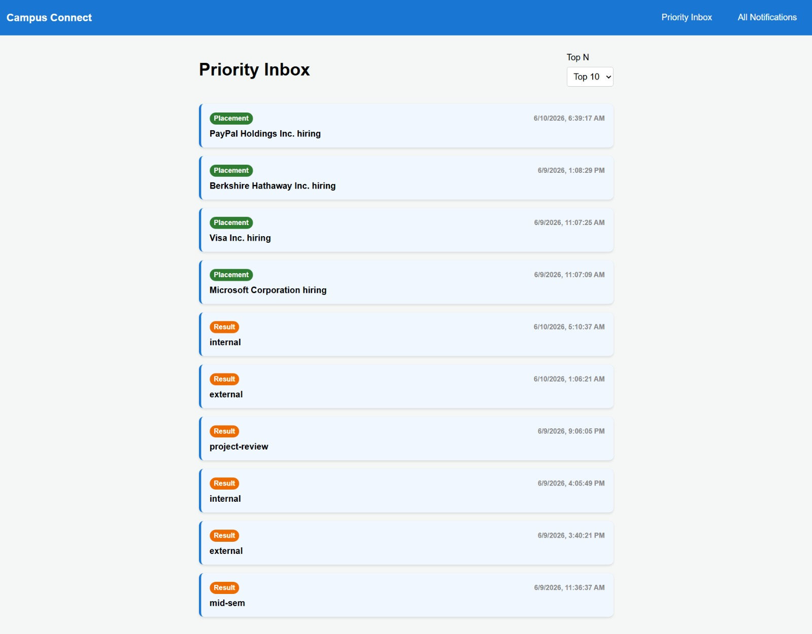
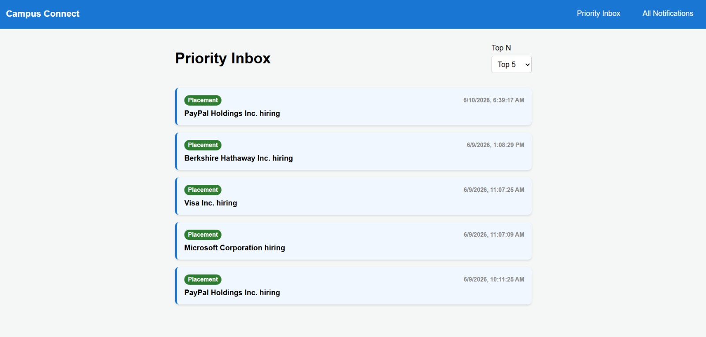
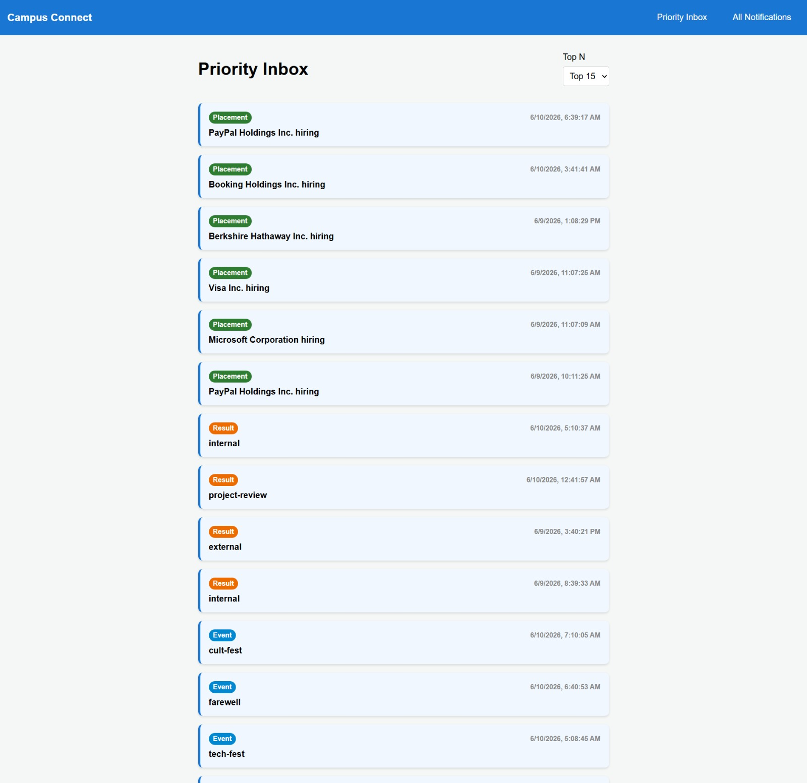
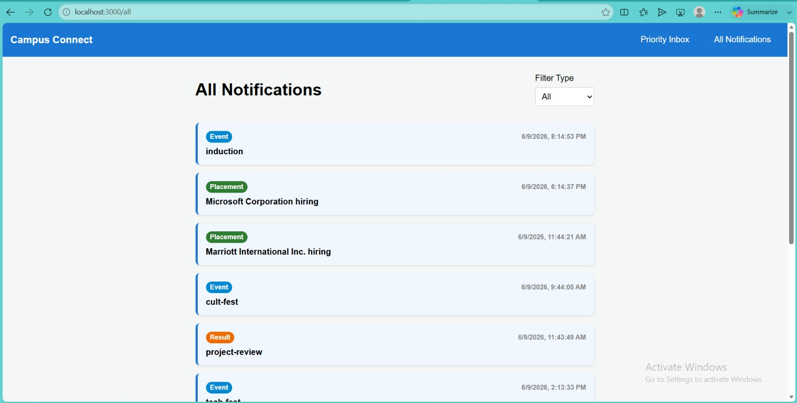
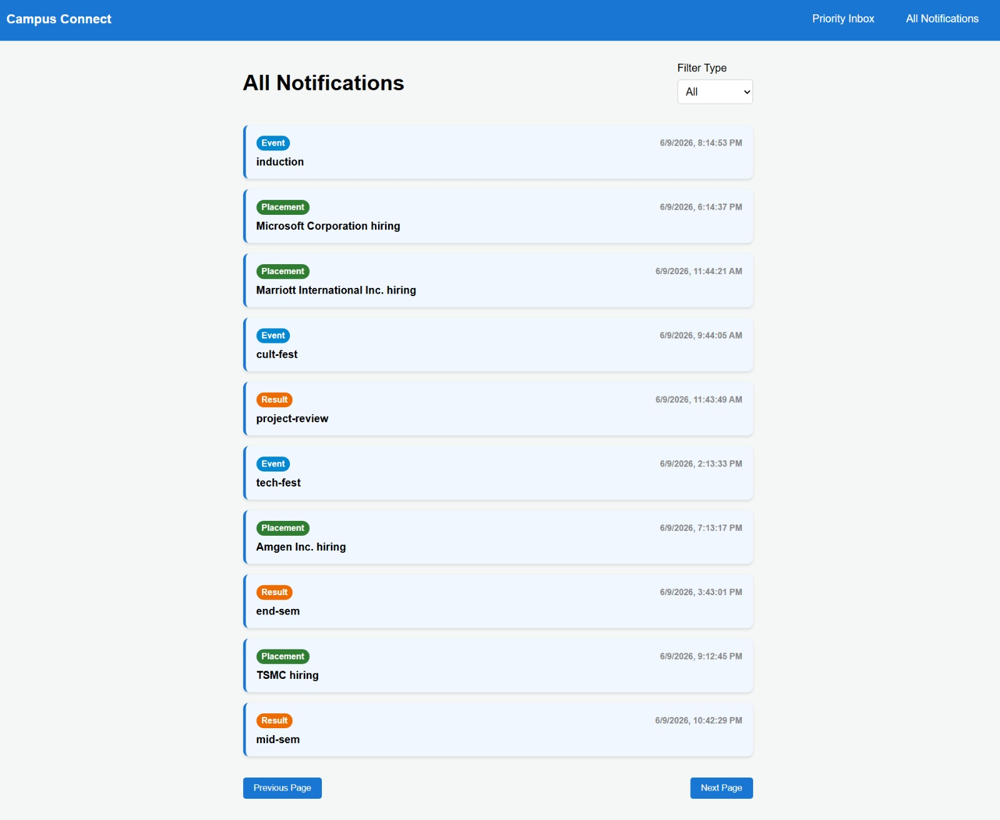
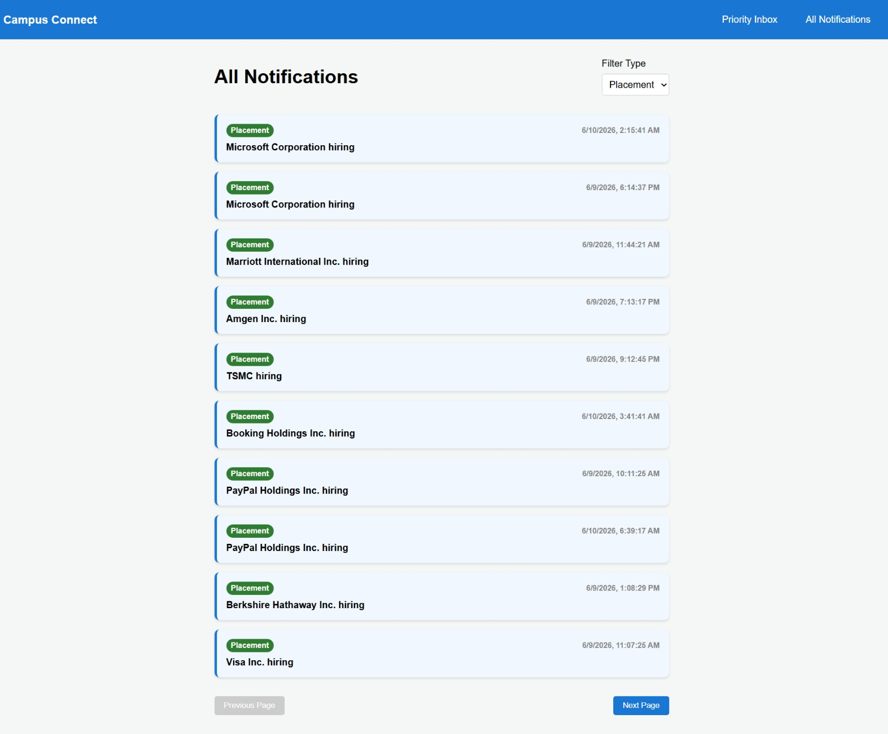

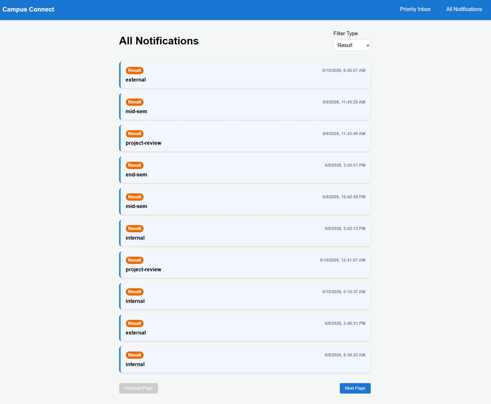
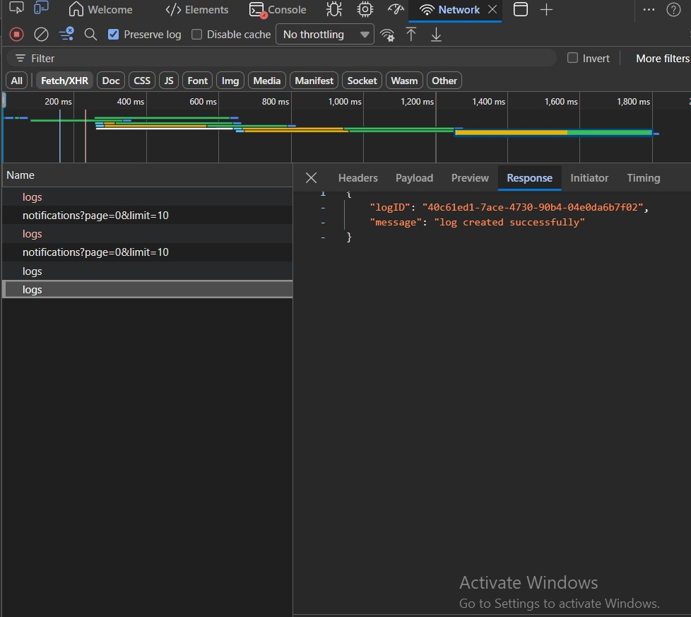
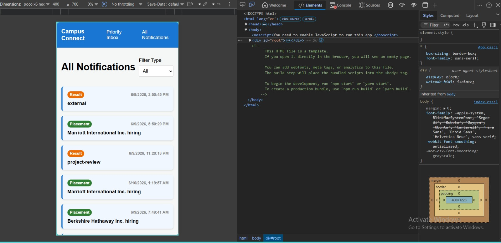
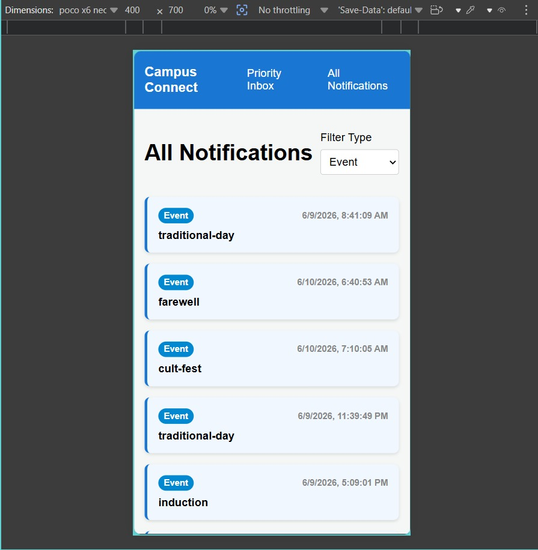
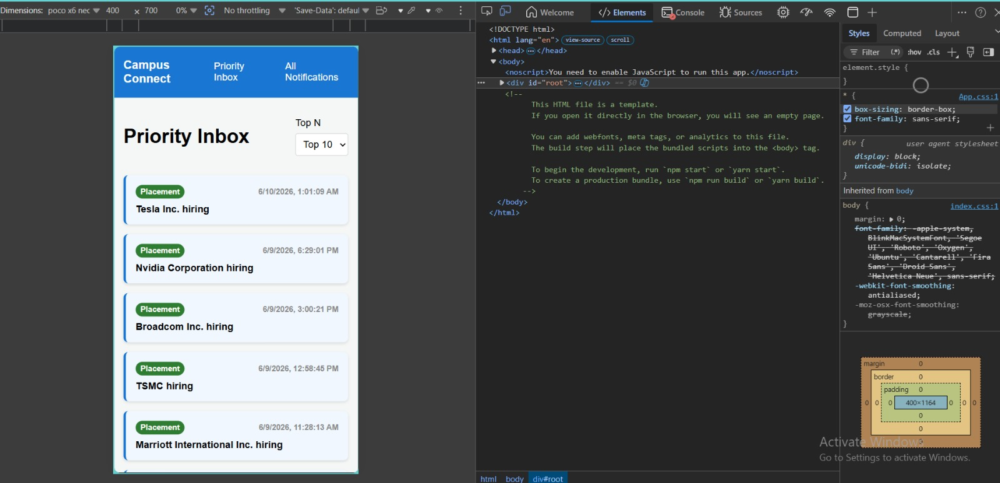

#### Video Walkthrough
<video src="./media/video.mp4" controls="controls" style="max-width: 100%;">
  Your browser does not support the video tag. [Click here to view the video](./media/video.mp4) directly.
</video>

## https://drive.google.com/file/d/1TGuWtlCgPmQAv7Q1mYRYdgdd_6k5iT9R/view?usp=sharing
